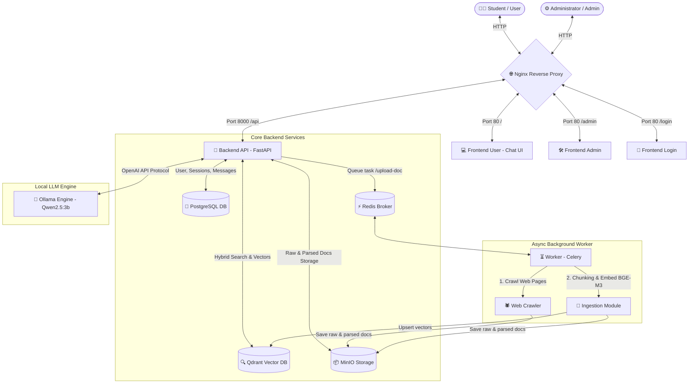

# rag-chatbot-uet

> 📁 Check out [**STRUCTURE.md**](STRUCTURE.md) for a detailed breakdown of the project directory structure and microservice layout.

<br />

<div align="center"><a href="#top"></a>


<h2 align="center">UET HANDBOOK & ACADEMIC REGULATIONS CHATBOT<br/>(HYBRID RAG CHATBOT MICROSERVICES)</h2>

<p align="center">
An intelligent web chatbot leveraging Microservices architecture, Hybrid RAG (Dense + Sparse Retrieval), ReRanker, and Large Language Models (LLM) to assist students in querying academic regulations, tuition fees, and scholarship criteria at UET with transparent real-time source citations.
<br />
</p>
</div>

<details>
<summary>Table of Contents</summary>
<ol>
<li><a href="#ℹ️-project-information">Project Information</a>
<ul>
<li><a href="#-team-members">Team Members</a></li>
<li><a href="#-tech-stack">Tech Stack</a></li>
</ul>
</li>
<li>
<a href="#️-installation--usage-guide">Installation & Usage Guide</a>
<ul>
<li><a href="#-system-requirements">System Requirements</a></li>
<li><a href="#-running-with-docker">Running with Docker</a></li>
<li><a href="#-manual-batch-ingestion-task">Manual Batch Ingestion Task</a></li>
</ul>
</li>
<li><a href="#️-architecture--system-flow">Architecture & System Flow</a></li>
<li><a href="#-project-directory-structure">Project Directory Structure</a></li>
<li><a href="#-key-features">Key Features</a></li>
<li><a href="#-application-screenshots">Application Screenshots</a></li>
<li><a href="#-future-roadmap">Future Roadmap</a></li>
</ol>
</details>

## ℹ️ Project Information

During their academic journey at the **VNU University of Engineering and Technology (UET - VNU)**, students frequently need to search for critical academic information, such as training regulations, tuition fee schedules, scholarship requirements, course registration guidelines, and administrative procedures. However, these documents are often scattered across various PDF files, DOCX announcements, and departmental web portals. Manual searching can be time-consuming and prone to missing key updates.

The **UET Handbook Hybrid RAG Microservices System** digitizes and automates this retrieval process using modern Artificial Intelligence (AI) technologies:

- **Ingestion & Preprocessing Pipeline:** Administrators or background Celery Workers gather raw web data (`.json`) and formal documents (`.pdf`, `.docx`). A smart semantic chunker divides text by Chapter, Section, and Article, computes embeddings via `BAAI/bge-m3`, and stores payloads concurrently in **Qdrant Vector DB** and **MinIO Object Storage**.
- **Question-Answering & Retrieval Flow:** Students input queries via the Chat UI. The system automatically executes a **Hybrid Search** combining keyword search (BM25 sparse vectors using the Vietnamese word segmenter `underthesea`) and semantic search (Dense vectors in Qdrant), re-ranks top contexts using **ReRanker** (`BAAI/bge-reranker-base`), and forwards context to an LLM (`qwen2.5:3b` via Ollama) to generate accurate responses with **transparent in-text citations** (`[Document X]`).

### 🔧 Tech Stack

Built using powerful open-source technologies:

<p align="left">
<a href="https://www.python.org/" target="_blank"></a> 
<a href="https://fastapi.tiangolo.com/" target="_blank"></a> 
<a href="https://www.postgresql.org/" target="_blank"></a>
<a href="https://redis.io/" target="_blank"></a>
<a href="https://developer.mozilla.org/en-US/docs/Web/HTML" target="_blank"></a> 
<a href="https://www.w3schools.com/css/" target="_blank"></a> 
<a href="https://nginx.org/" target="_blank"></a> 
<a href="https://www.docker.com/" target="_blank"></a>
</p>

| Component | Technology | Role in System |
| :--- | :--- | :--- |
| **Gateway / Reverse Proxy** | Nginx | Reverse proxy, SSL/HTTP routing, load balancing |
| **Backend API** | Python 3.10, FastAPI | High-performance async RESTful API, RAG Orchestration & Session management |
| **Relational Database** | PostgreSQL 15 | Stores user accounts, authentication data, chat sessions & messages |
| **Vector Database** | Qdrant | High-speed storage & retrieval for 1024D vector embeddings |
| **Object Storage** | MinIO (S3-compatible) | Stores raw document files (`.pdf`, `.docx`) and scraped web JSON files |
| **Message Broker & Queue**| Redis 7 | Message broker coordinating asynchronous background tasks |
| **Background Worker** | Celery | Handles background web scraping, document parsing, and vector ingestion |
| **Embedding Model** | `BAAI/bge-m3` | Multi-lingual semantic embedding (Dense 1024D) |
| **ReRanker Model** | `BAAI/bge-reranker-base` | Re-ranks relevance scores between user query and retrieved passages |
| **Local LLM Engine** | Ollama (`qwen2.5:3b`) | Generates natural, accurate responses in Vietnamese |
| **Frontend** | HTML5, Vanilla CSS, JS (ES6) | Lightweight UIs for Student Chatbot, Authentication & Admin Dashboard |
| **Deployment** | Docker, Docker Compose | Containerized orchestration of all microservices |

## ⚙️ Installation & Usage Guide

### 📦 System Requirements

The system is optimized to run inside Docker containers. Ensure you have installed:

- **Docker** (>= 20.10) and **Docker Compose** (>= 2.0).
- **Ollama Engine** (with `qwen2.5:3b` model pulled) running locally or via `uet_ollama` container.

### 🐳 Running with Docker

1. **Clone the repository:**

   ```bash
   git clone https://github.com/TruongDv-006/rag-chatbot-uet.git
   ```

2. **Navigate to project root:**

   ```bash
   cd rag-chatbot-uet
   ```

3. **Launch system with Docker Compose:**
   This command automatically builds images, initializes networks, and launches Nginx, PostgreSQL, Qdrant, MinIO, Redis, Celery Worker, and Backend API containers.

   ```bash
   docker-compose up -d --build
   ```

   ⚠️ *Note:*
   On first launch, `uet_worker` and `uet_backend` may take **1-2 minutes** to download weights for `bge-m3` and `bge-reranker-base` models if not cached locally.

4. **Access Applications:**
   - **Student Chatbot UI:** [http://localhost](http://localhost) (Port 80)
   - **Login & Registration Page:** [http://localhost/login](http://localhost/login)
   - **Admin Dashboard:** [http://localhost/admin](http://localhost/admin)
   - **FastAPI Documentation (Swagger UI):** [http://localhost:8000/docs](http://localhost:8000/docs)
   - **Qdrant Web Dashboard:** [http://localhost:6333/dashboard](http://localhost:6333/dashboard)

5. **Stop Services:**
   ```bash
   docker-compose down
   ```

---

### 🔌 Manual Batch Ingestion Task

To re-run web crawling or re-ingest all document files from MinIO into Qdrant Vector Database manually:

```bash
docker exec -it uet_worker python -m worker.ingestion.ingester
```

## 🏗️ Architecture & System Flow



The Microservices architecture enforces clear separation of concerns:

- **Nginx Gateway:** Acts as a reverse proxy, serving static assets for frontends and routing API requests to FastAPI backend.
- **Backend API (FastAPI):** Handles RAG orchestration (Retrieval, ReRanking, LLM Prompting), JWT authentication, and session endpoints.
- **Qdrant Vector DB:** Stores 1024D vector embeddings and performs high-speed Hybrid Search (Sparse BM25 + Dense Vectors).
- **MinIO Object Storage:** Stores raw files (`.pdf`, `.docx`) and web crawl `.json` payloads.
- **PostgreSQL 15:** Manages relational user profiles, chat session metadata, and historical messages.
- **Redis & Celery Worker:** Handles background queues for asynchronous long-running tasks such as document ingestion and web scraping.
- **Ollama LLM Engine:** Hosts local LLM (`qwen2.5:3b`) to generate natural answers grounded strictly in retrieved context.

## 📁 Project Directory Structure

> 📄 For the complete directory tree and detailed module breakdown, please refer to [**STRUCTURE.md**](STRUCTURE.md).

```text
rag-chatbot-uet/
├── docker-compose.yml           # Microservices orchestration configuration
├── nginx/                       # Gateway & Reverse Proxy configuration
├── frontend-login/              # Authentication UI
├── frontend-user/               # Student Chatbot UI
├── frontend-admin/              # Admin Dashboard UI
├── backend-api/                 # FastAPI Server RAG & Logic Core
├── worker/                      # Celery Background Worker & Ingestion Pipeline
└── infrastructure/              # Persistent Database Volumes (MinIO, Postgres, Qdrant)
```

## 🖥️ Key Features

- 🔍 **Advanced Hybrid Search RAG:** Combines **BM25 Keyword Search** (`underthesea` Vietnamese word segmentation) + **Semantic Dense Search** (Qdrant `bge-m3`) + **Reciprocal Rank Fusion (RRF)** + **ReRanker** (`BAAI/bge-reranker-base`).
- 📌 **Transparent Source Citation System:**
  - Automatically appends inline citation badges directly in responses: `[Document 1]`, `[Document 2]`.
  - Compiles an aggregated **Reference List** at the end of answers, displaying only verified context sources.
- 🛡️ **Strict Anti-Hallucination Guardrails:** Binds LLM output tightly to retrieved context. Returns standard fallback responses when information is absent from database.
- 📂 **Multi-Format Processing:** Supports `.pdf`, `.docx`, and web `.json` files with smart hierarchical chunking by Chapter, Section, and Article.
- 👥 **Role-Based Auth & Session Tracking:** Complete JWT sign-up/login system with session memory for students and Admin Dashboard for document management.
- ⚡ **High-Performance Asynchronous Architecture:** Decouples heavy processing tasks into background Celery workers via Redis queues.

## 🖼️ Application Screenshots

### 1. Student Chatbot Interface (User Chat UI)
<div align="center">
   
</div>

### 2. Login & Registration Page (Auth UI)
<div align="center">
   
</div>

### 3. Admin Management Panel (Admin Dashboard)
<div align="center">
   
</div>

## 📈 Future Roadmap

Planned enhancements for future iterations:

- **Response Streaming (SSE / WebSockets):** Enable real-time token streaming (typewriter effect) to improve user UX.
- **Multi-turn Memory Summarization:** Context window summarization to maintain long conversation turns efficiently.
- **GraphRAG Integration:** Knowledge Graph integration to model complex inter-document relationships in academic regulations.
- **Multimodal RAG Support:** Extract and understand embedded tables and flowcharts within regulation PDFs.
- **Vietnamese LLM Fine-Tuning:** Domain-specific fine-tuning on UET academic guidelines to enhance accuracy and tone.

<p align="center">(<a href="#top">back to top</a>)</p>

---

### 📝 Notes

- If you have questions or suggestions, feel free to submit an issue or pull request on GitHub.
- This software is developed for educational purposes and academic regulation inquiry at VNU University of Engineering and Technology (UET - VNU).
- Thank you for your interest in our project!