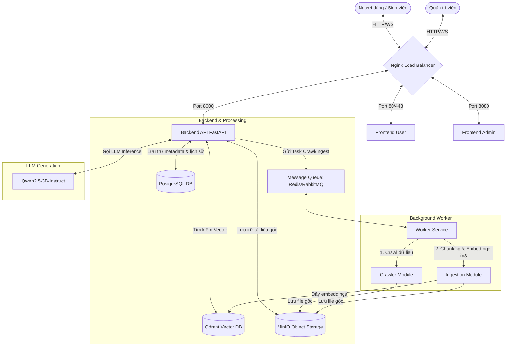

# UET Handbook RAG Microservices 🚀

Hệ thống Chatbot tra cứu **Sổ tay Sinh viên UET** (UET Handbook) sử dụng kiến trúc **Microservices** kết hợp công nghệ **RAG** (Retrieval-Augmented Generation). 

Hệ thống cho phép người dùng hỏi đáp thông tin chính xác về quy chế, quy định học tập, học phí, học bổng tại UET; đồng thời hỗ trợ quản trị viên quản lý, cập nhật tài liệu và theo dõi tiến trình xử lý dữ liệu tự động.

---

## 🏗️ Kiến Trúc Hệ Thống (Architecture)

Sơ đồ hoạt động của các dịch vụ trong hệ thống:



---

## 📁 Cấu Trúc Thư Mục Dự Án

Chi tiết tổ chức thư mục của dự án `uet-handbook-rag-microservices`:

```text
uet-handbook-rag-microservices/
├── docker-compose.yml           # "Trái tim" khởi chạy toàn bộ hệ thống (Nginx, Frontend, Backend, Worker, DBs)
├── .env                         # Chứa các biến môi trường (Database passwords, API Keys,...)
├── README.md                    # Tài liệu hướng dẫn cài đặt và sử dụng (File này)
│
├── nginx/                       # 🌐 Load Balancer & Cổng điều hướng chính
│   ├── nginx.conf               # Định tuyến request tới Frontend User, Admin và Backend API
│   └── Dockerfile
│
├── frontend-user/               # 🧑‍💻 Giao diện Chatbot dành cho Sinh viên (thay thế app.py gốc)
│   ├── src/                     # Code React/Vite hiển thị khung chat, lịch sử chat và nguồn trích dẫn
│   └── Dockerfile
│
├── frontend-admin/              # ⚙️ Giao diện Quản trị dành cho Admin
│   ├── src/                     # Giao diện quản lý user, upload PDF/Docx, theo dõi tiến độ Ingestion
│   └── Dockerfile
│
├── backend-api/                 # 🧠 API Server xử lý Logic Chat & Truy hồi RAG
│   ├── app/
│   │   ├── retriever/           # Hybrid Search (Kết hợp từ khóa BM25 + ngữ nghĩa Vector) & Reranking
│   │   ├── generation/          # Kết nối LLM Qwen2.5-3B-Instruct, xử lý Prompt, chống ảo tưởng (Anti-Hallucination)
│   │   ├── routes/              # Định nghĩa API endpoints (vd: /chat, /upload, /status)
│   │   └── main.py              # Entrypoint khởi chạy server FastAPI
│   ├── requirements.txt         # Các thư viện Python cần thiết cho backend
│   └── Dockerfile
│
├── worker/                      # ⏳ Bộ xử lý tác vụ chạy nền (Background Worker)
│   ├── crawler/                 # Cào và tự động tải dữ liệu từ các website Sổ tay UET
│   ├── ingestion/               # Đọc file, phân tách văn bản (Chunking) và nhúng vector bằng model BGE-M3
│   ├── tasks.py                 # Định nghĩa các task Celery/RQ nhận lệnh từ Message Queue
│   ├── requirements.txt         # Các thư viện xử lý tài liệu (BeautifulSoup, PyPDF2, LangChain, SentenceTransformers...)
│   └── Dockerfile
│
└── infrastructure/              # 🗄️ Lưu trữ dữ liệu lâu bền (Docker Volumes)
    └── volumes/
        ├── sql_data/            # Lưu trữ cơ sở dữ liệu quan hệ (Người dùng, Phân quyền, Lịch sử chat)
        ├── minio_data/          # Object Storage lưu file PDF, DOCX hoặc ảnh gốc từ Sổ tay
        └── qdrant_data/         # Vector Database lưu các vectors nhúng để tìm kiếm nhanh
```

---

## 🛠️ Công Nghệ Sử Dụng (Tech Stack)

| Thành phần | Công nghệ lựa chọn | Vai trò |
| :--- | :--- | :--- |
| **Reverse Proxy / Gateway** | Nginx | Định tuyến, cân bằng tải, SSL Termination |
| **Frontend User & Admin** | React (Vite) / TailwindCSS | Xây dựng giao diện web phản hồi nhanh, trực quan |
| **Backend API** | FastAPI (Python) | High-performance API, tích hợp luồng RAG bất đồng bộ |
| **Task Queue / Broker** | Redis / RabbitMQ | Điều phối tác vụ cào dữ liệu và ingest văn bản chạy ngầm |
| **Background Worker** | Celery / Arq | Xử lý các job nặng bất đồng bộ để tránh nghẽn API chính |
| **Vector Database** | Qdrant | Lưu trữ và tìm kiếm vector ngữ nghĩa với tốc độ cao |
| **Object Storage** | MinIO | Lưu trữ tệp tin tài liệu gốc tải lên từ Admin hoặc Crawled |
| **Relational Database** | PostgreSQL / MySQL | Quản lý tài khoản, phân quyền quản trị, lịch sử trò chuyện |
| **Embedding Model** | BGE-M3 (`bge-m3`) | Model nhúng hỗ trợ tiếng Việt cực tốt, đa ngôn ngữ, hỗ trợ độ dài văn bản lớn |
| **Large Language Model** | Qwen2.5-3B-Instruct | Sinh câu trả lời tự nhiên, chính xác dựa trên ngữ cảnh trích dẫn |

---

## ⚙️ Hướng Dẫn Cài Đặt & Sử Dụng

### 1. Chuẩn bị môi trường
Yêu cầu hệ thống đã cài đặt sẵn:
- **Docker** (phiên bản >= 20.10)
- **Docker Compose** (phiên bản >= 2.0)

### 2. Thiết lập biến môi trường (`.env`)
Tạo file `.env` ở thư mục gốc của dự án dựa trên các biến cấu hình sau:
```env
# Database cấu hình
POSTGRES_USER=uet_user
POSTGRES_PASSWORD=uet_secret_password
POSTGRES_DB=uet_handbook_db

# Qdrant Vector DB cấu hình
QDRANT_HOST=qdrant
QDRANT_PORT=6333

# MinIO Object Storage cấu hình
MINIO_ROOT_USER=admin
MINIO_ROOT_PASSWORD=minio_secret_password
MINIO_DEFAULT_BUCKETS=uet-handbook

# Redis làm Message Broker
REDIS_URL=redis://redis:6379/0

# LLM & API Keys
LLM_API_BASE=http://your-llm-server-or-ollama:11434/v1
LLM_MODEL_NAME=qwen2.5:3b-instruct
EMBEDDING_MODEL_NAME=BAAI/bge-m3

# JWT Secret Key cho phân quyền Admin
JWT_SECRET=your_super_secret_jwt_key
```

### 3. Khởi chạy toàn bộ hệ thống bằng Docker Compose
Tại thư mục gốc của dự án, chạy lệnh sau:
```bash
docker-compose up --build -d
```

Lệnh này sẽ tải các image cần thiết, build các container tự định nghĩa (`nginx`, `frontend-user`, `frontend-admin`, `backend-api`, `worker`) và chạy chúng dưới dạng daemon (chạy ngầm).

### 4. Kiểm tra trạng thái hệ thống
Sử dụng lệnh sau để kiểm tra xem các dịch vụ có hoạt động bình thường không:
```bash
docker-compose ps
```

---

## 🔌 Danh Sách API Endpoints (Sơ bộ)

### 🧑‍💻 Luồng User (Khách)
* `POST /api/chat`: Gửi câu hỏi, nhận phản hồi RAG kèm theo danh sách nguồn tài liệu tham khảo (citations).
* `GET /api/chat/history`: Lấy lại lịch sử chat của phiên làm việc.

### ⚙️ Luồng Admin
* `POST /api/admin/upload`: Tải lên tài liệu mới (PDF/DOCX) để đưa vào hàng đợi Ingest.
* `POST /api/admin/crawl`: Kích hoạt worker cào dữ liệu từ đường dẫn website Sổ tay UET.
* `GET /api/admin/tasks/status`: Theo dõi trạng thái tiến độ các tác vụ xử lý ngầm (Crawl/Ingestion).
* `GET /api/admin/documents`: Danh sách các tài liệu hiện có trong hệ thống và trạng thái của chúng (Chờ xử lý, Đang nhúng, Đã nhúng).

---

## 🤝 Hướng Dẫn Phát Triển (Development Guide)

Để phát triển riêng lẻ từng service dưới máy local mà không cần đóng gói Docker:

1. **Khởi chạy Infrastructure trước**:
   ```bash
   docker-compose up -d redis qdrant minio db
   ```
2. **Khởi chạy Backend**:
   - Truy cập `backend-api/`, tạo môi trường ảo Python và cài đặt thư viện (`pip install -r requirements.txt`).
   - Chạy FastAPI bằng: `uvicorn app.main:app --reload`.
3. **Khởi chạy Worker**:
   - Truy cập `worker/`, cài đặt thư viện (`pip install -r requirements.txt`).
   - Chạy worker thông qua celery hoặc arq tùy theo công nghệ triển khai cụ thể.
4. **Khởi chạy Frontends**:
   - Truy cập `frontend-user/` hoặc `frontend-admin/`.
   - Cài đặt dependency (`npm install`) và khởi chạy máy chủ phát triển (`npm run dev`).